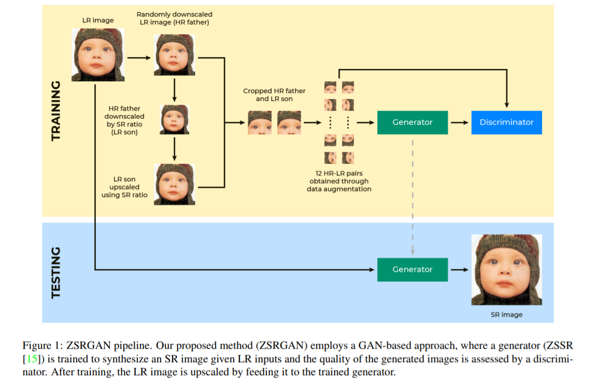
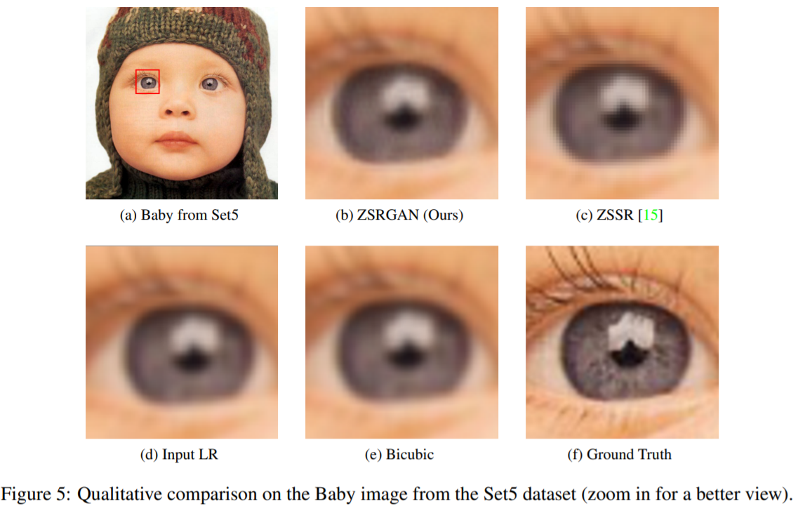
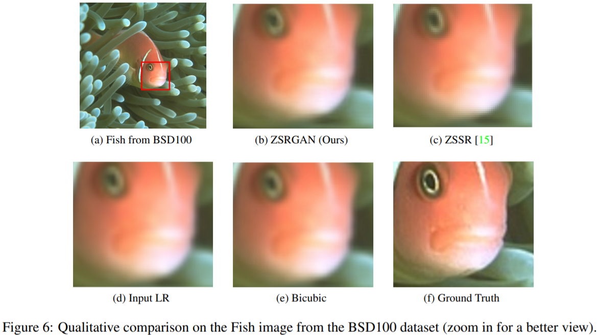

# ZSRGAN: Zero-shot Super-Resolution with Generative Adversarial Network(Pytorch)
### 2021-fall-AI604-KAIST /  TEAM 19

-----------------

# Overview:

## Pipeline

## 

## Results:






----------
# Usage:

## Run on sample dataset:
First, the sample data(Set5) already are placed in ```<ZSRGAN_path>/datasets/MySet5```

The results will save in ```<ZSRGAN_path>/experiments/```

```
python train.py --name <save_result_path>
```
## Run on your data:
You can find additional dataset 
from [Here](https://drive.google.com/file/d/16L961dGynkraoawKE2XyiCh4pdRS-e4Y/view) 
provided by [MZSR](https://github.com/JWSoh/MZSR) (CVPR 2020)

First, put your data files in ```<ZSRGAN_path>/datasets/```

The results will save in ```<ZSRGAN_path>/experiments/```

```
python train.py --name <save_result_path> --dataset <name_of_your_dataset> --GT_path <HR_folder_in_your_dataset> --LR_path <LR_folder_in_your_dataset>
```
#Acknowledgement
Our project was based on [ZSSR](https://github.com/assafshocher/ZSSR) (CVPR 2018) and the data was taken from [MZSR](https://github.com/JWSoh/MZSR) (CVPR 2020).
